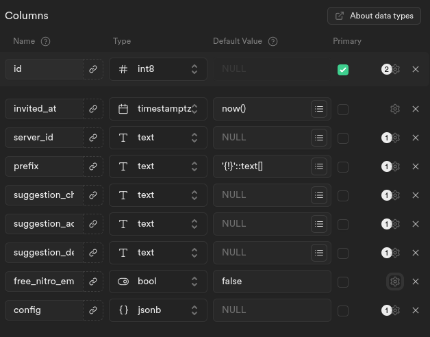
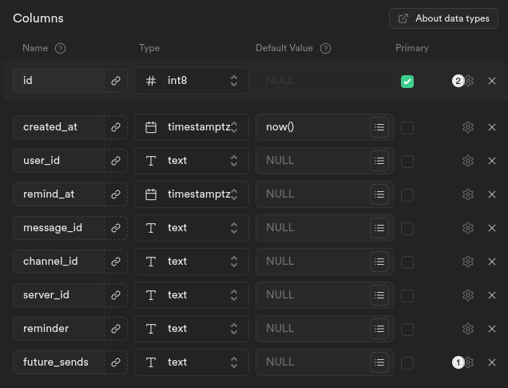

# Bidome

> [!NOTE]
> You are currently viewing the stable and public release of Bidome. To view the
> currently ongoing rewrite check out the
> [v-alyx branch](https://github.com/Wave-Studio/BIDOME/tree/v-alyx)

## What is Bidome?

Bidome is a multipurpose Discord bot trying to offer something for everyone. You
can view a command list Here (soon:tm:)

## Selfhosting

### Disclaimer

While you can selfhost Bidome it is suggested that you use the
[public instance](https://discord.com/api/oauth2/authorize?client_id=778670182956531773&permissions=8&scope=applications.commands%20bot)
so you don't need to go through the configuration process. If you do want to
selfhost then follow the guide below:

### Requirements

- [Java](https://adoptium.net/marketplace/)
  - [Lavalink](https://github.com/lavalink-devs/Lavalink)
- [Deno](https://deno.land/)
- [Discord](https://discord.com/developers/applications/) bot account
- [Supabase](https://supabase.com/dashboard/projects) project

### Steps

1. Copy the `.env.example` file over to `.env`
1. Set up a Lavalink node
   ([Guide](https://lavalink.dev/getting-started/index.html)) and place the
   credentials into `.env`
1. Create a Supabase project and set the Supabase URL and secret_role values
   into `.env`
1. When creating tables in Supabase ensure that:
   - Realtime & RLS are enabled for each table
   - `Is Unique` & `Is Identity` are enabled for each primary value
1. Create the tables that Bidome uses:
   1. servers
      - 
      - For column settings every row that has null as the default value has
        `Is Nullable` enabled
      - For columns that are cut off in the picture you can skip them other than
        `free_nitro_emotes`
      - `prefix` has `Define as Array` enabled
   1. reminders
      - 
      - `future_sends` has `Define as Array` enabled
1. Enable the `presence`, `message content`, and `server members` intent on the
   Discord Dashboard
1. Run the bot
   - To use the automatic Crash handler run `deno task runProd`
   - To not use the automatic Crash handler run `deno task run`
